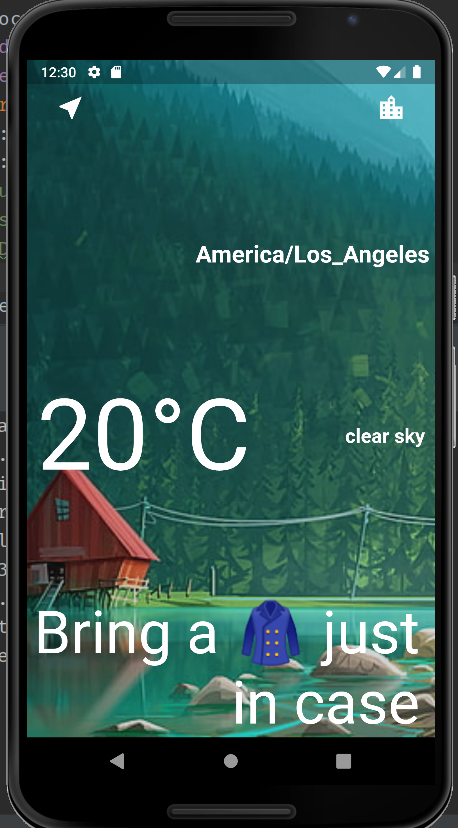
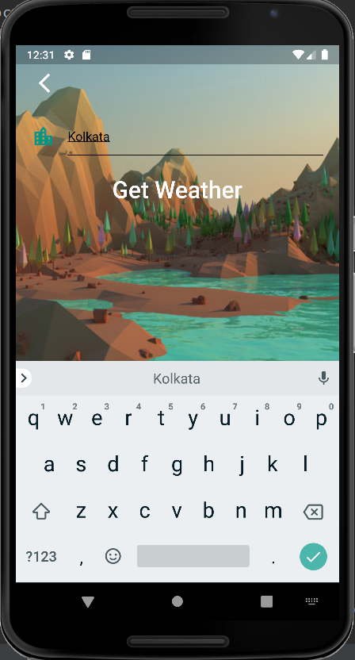
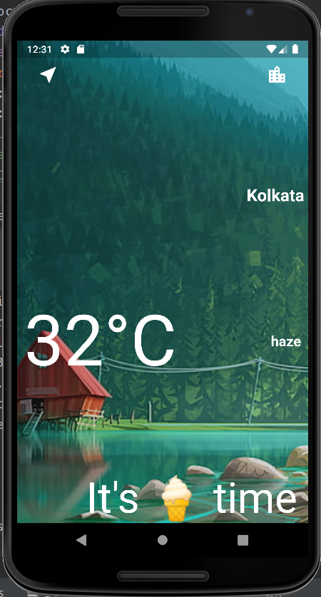

# Clima_Flutter
An Android and iOS application for getting weather of a given location or the Present location.

#Features:
    
    Uses the location from the device . 
    Fetches details from Openweater API. 
    Takes User Input of any City to Show the weather. 

#Demo:
    front Screen / Weather page:

    User Input City screen:

    
    City Weather page:
    

